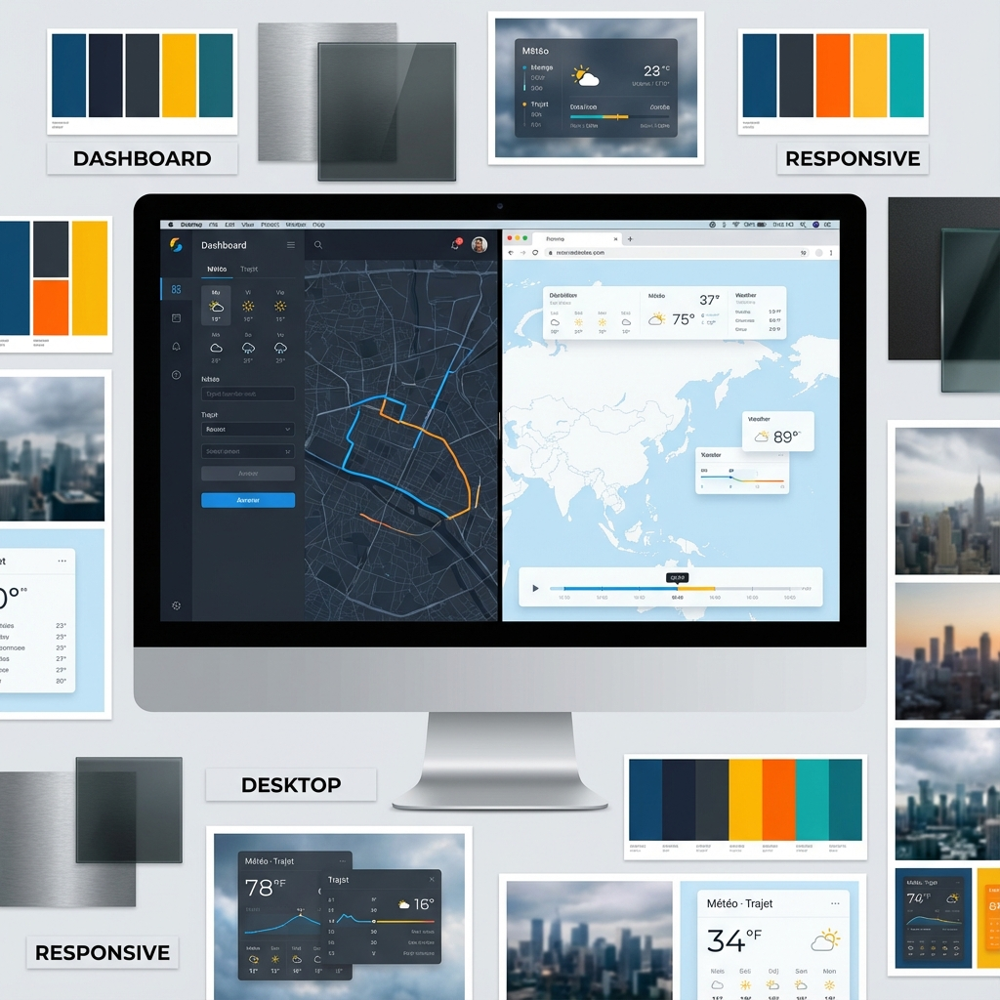
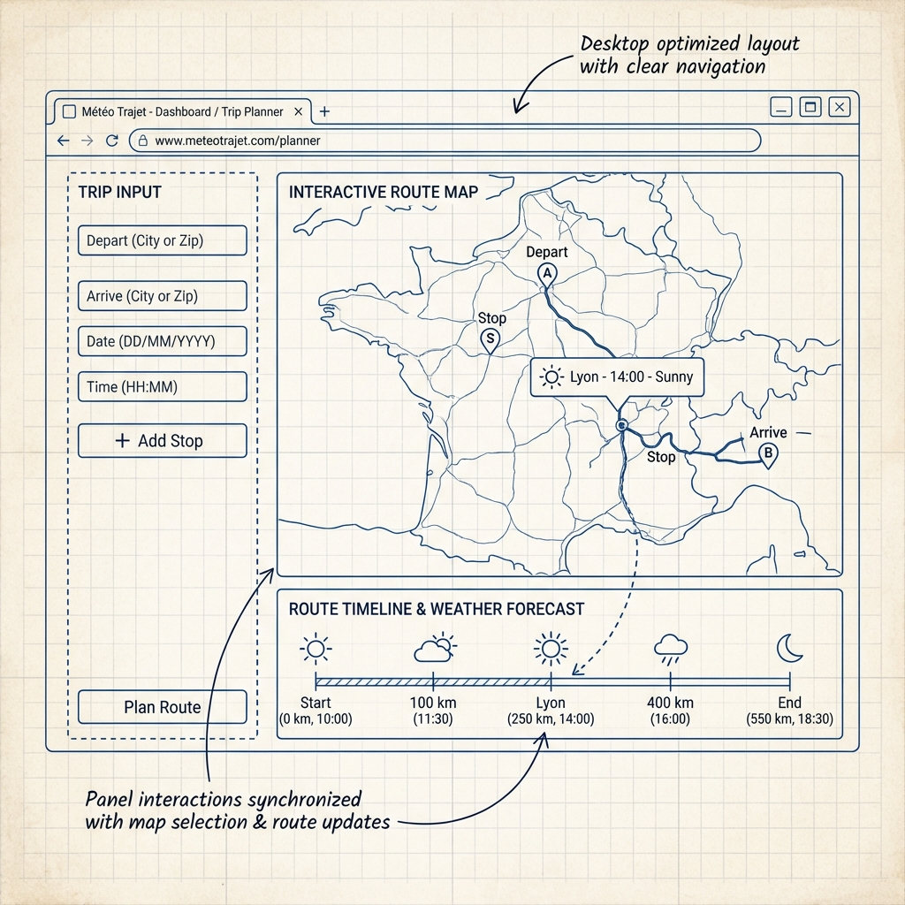

# Design Assets for Météo Trajet

I have copied the generated images into your project's `assets/` folder so you can view them easily.

## Moodboard (Web App Focus)
A visual exploration of the dashboard aesthetic, color palette, and "cockpit" feel.

## Wireframes (Web App Layout)
Low-fidelity structural concepts showing the layout of the main dashboard: sidebar for input, large map area, and synchronized timeline.

